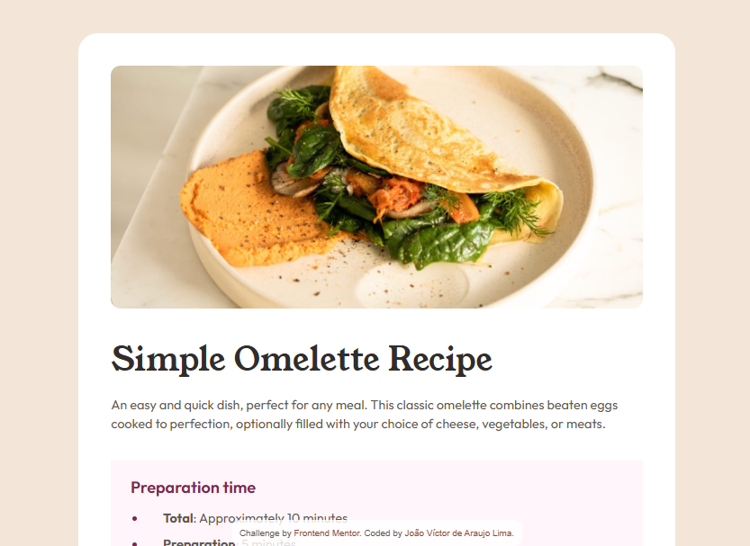
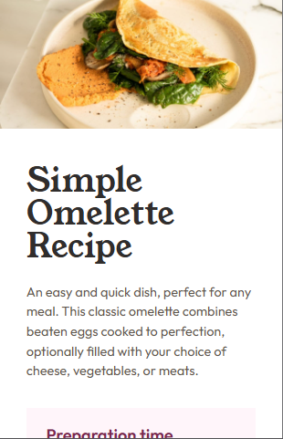

# Frontend Mentor - Recipe page solution

## Languages
This first section is in English. 

[Versão em português logo abaixo.](#portuguese)

## Context

This is a solution to the [Recipe page challenge on Frontend Mentor](https://www.frontendmentor.io/challenges/recipe-page-KiTsR8QQKm). Frontend Mentor challenges help you improve your coding skills by building realistic projects. 

> Your challenge is to build out this recipe page and get it looking as close to the design as possible.

## Table of contents

- [Overview](#overview)
  - [Screenshot](#screenshot)
  - [Links](#links)
- [My process](#my-process)
  - [Built with](#built-with)
  - [What I learned](#what-i-learned)
  - [Useful resources](#useful-resources)
- [Author](#author)

## Overview

### Screenshot

#### Desktop

<p align="center">
  
</p>

#### Mobile

<p align="center">
  
</p>

### Links

- Solution URL: [GitHub Repository](https://github.com/xuaun/recipe-page)
- Live Site URL: [Live Page](https://xuaun.github.io/recipe-page/)

## My process

### Built with

- Semantic HTML5 markup
- CSS custom properties
  - `<ul>`
  - `<ol>`
  - `<table>`
- Flexbox
- Media Query

### What I learned

In this project I was able to use flexbox, and variable, and media query concepts in CSS, as well as using a ready-made Figma design to create this component.

I was also able to train how to use `<table>` tags and class naming using the BEM methodology.

```html
<table class="table" cellspacing="0">
  <tbody class="table__body">
    <tr class="table__row first-row">
      <td class="table__data">Calories</td>
      <td class="table__data table__data--highlighted">277kcal</td>
    </tr>
    <!-- Some HTML code -->
  </tbody>
</table>
```

### Useful resources

- [BEM 101](https://css-tricks.com/bem-101/) - This helped me to know and understand how to apply the basics of this class naming methodology.

## Author

- Website - [João Víctor de Araujo Lima's Portfolio](https://xuaun.github.io/)
- Frontend Mentor - [@xuaun](https://www.frontendmentor.io/profile/xuaun)

____
<br>

# <p id="portuguese">Frontend Mentor - Solução do projeto de página de receita</p>

## Contexto

Esta é uma solução para o [desafio de página de receita no Frontend Mentor](https://www.frontendmentor.io/challenges/qr-code-component-iux_sIO_H). Os desafios do Frontend Mentor ajudam você a melhorar suas habilidades de codificação construindo projetos realistas.

> Seu desafio é criar esta página de receita e fazer com que ela tenha a aparência mais próxima possível do design.

## Lista de conteúdos

- [Visão Geral](#visão-geral)
  - [Desafio](#desafio)
  - [Prints](#prints)
  - [Links](#links-pt)
- [Meu processo](#meu-processo)
  - [Tecnologias utilizadas](#tecnologias-utilizadas)
  - [O que eu aprendi](#o-que-eu-aprendi)
  - [Recursos úteis](#recursos-úteis)
- [Autor](#autor)

## Visão Geral

### Desafio

Os usuários devem ser capazes de:

- Ver estados de foco e hover para todos os elementos interativos na página

### Prints

#### Computador

<p align="center">
  
</p>

#### Celular

<p align="center">
  
</p>

### <p id="links-pt">Links</p>

- Link da solução: [Repositório no GitHub](https://github.com/xuaun/recipe-page)
- Site com a solução: [Página no ar](https://xuaun.github.io/recipe-page/)

## Meu processo

### Tecnologias utilizadas

- HTML5
- CSS
  - `<ul>`
  - `<ol>`
  - `<table>`
- Flexbox
- Media Query

### O que eu aprendi

Neste projeto eu pude utilizar conceitos de flexbox, de variáveis e de media query no CSS, além de usar um design pronto do Figma para a elaboração deste componente.

Eu também pude treinar como aplicar tags de `<table>` e nomeação de classes usando a metodologia BEM.

```html
<table class="table" cellspacing="0">
  <tbody class="table__body">
    <tr class="table__row first-row">
      <td class="table__data">Calories</td>
      <td class="table__data table__data--highlighted">277kcal</td>
    </tr>
    <!-- Some HTML code -->
  </tbody>
</table>
```

### Recursos úteis

- [BEM 101](https://css-tricks.com/bem-101/) - Isso me ajudou a conhecer e entender como aplicar o básico dessa metodologia de nomeação de classes.

## Autor

- Website - [Portfólio - João Víctor de Araujo Lima](https://xuaun.github.io/)
- Frontend Mentor - [@xuaun](https://www.frontendmentor.io/profile/xuaun)
